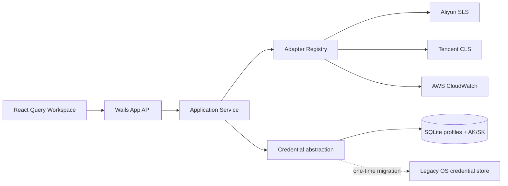

# LogGopher 设计文档

## 设计目标与非目标

目标是用稳定的领域模型统一多个日志平台的连接、资源发现与查询流程，并提供接近云厂商控制台的桌面交互。优先保证边界可扩展、凭证不越过 Go 后端边界和真实云平台链路可验证。

当前非目标：跨平台查询语法转换、聚合可视化、实时 Tail、团队凭证同步和多窗口协作。阿里云 SLS、腾讯云 CLS 与 AWS CloudWatch Logs 已接入官方 SDK；其余厂商能力不会在未接入时伪实现。

## 架构

- `App`：Wails 边界，只做输入校验与用例转发。
- `Service`：连接会话、Adapter 调度、持久化编排。
- `Adapter`：隔离厂商 SDK，输出统一 Domain DTO。
- `Store`：管理 SQLite 连接、migration 和参数化 SQL。
- `React UI`：连接向导、Logstore 导航、查询编辑器与结果表。

## 关键决策

| 日期 | 决策 | 理由 | 影响 |
|---|---|---|---|
| 2026-07-11 | 模块化单体 | 桌面工具无需微服务运维成本，包边界仍可测试 | 单进程部署，演进简单 |
| 2026-07-11 | Wails v2.10.2 | 支持 Go 1.23，模板与生态稳定 | 后续升级需查 breaking changes |
| 2026-07-11 | modernc SQLite | 纯 Go、跨平台构建不依赖系统 SQLite | 二进制体积增加 |
| 2026-07-14 | AK/SK 随 Profile 存入 SQLite | 连接配置作为单一本地数据单元保存，避免系统凭证授权弹窗 | 本地数据库泄露会同时暴露云凭证；旧 Keychain 数据首次读取后迁移并删除 |
| 2026-07-12 | SLS 使用官方 `aliyun-log-go-sdk` | SDK 原生处理签名、压缩、进度轮询和错误模型 | 厂商类型只存在于 `internal/adapter`，请求受 30 秒超时和 Wails 生命周期约束 |
| 2026-07-12 | CLS 使用官方 API 3.0 Go SDK | `DescribeTopics` 和 `SearchLog` 与最新 API 契约一致 | Topic 名称到 ID 的映射仅存在于 Adapter 会话缓存；请求使用 CQL、毫秒时间和 Offset 分页 |
| 2026-07-12 | CloudWatch Logs 使用 AWS SDK for Go v2 | 官方 SigV4、Region 与 pagination token 行为由 SDK 实现 | 使用 Filter Pattern；总数为安全下界，厂商类型只存在于 `internal/adapter` |
| 2026-07-12 | 删除本地演示能力与数据 | 产品只展示真实可用平台，避免假数据与线上行为混淆 | migration 清理历史 Demo Profile 和 Query History，Registry/UI 不再暴露 Demo |
| 2026-07-11 | 设置写入 SQLite | 桌面偏好需跨重启保留且不含敏感信息 | 单行 `app_settings`，值域受约束 |
| 2026-07-11 | 原生菜单 + 窗内快捷入口 | 遵循桌面平台习惯，同时保证跨平台可发现性 | 菜单经 Wails Events 驱动 React 状态 |

## 查询契约

`ConnectionInput` 携带平台连接信息；连接成功返回 `Session.Groups`，以厂商中立的父资源分组承载 Logstore。SLS 将其映射为 `Project → Logstore`，CLS 将 Region 映射为 Topic 分组，CloudWatch Logs 映射为 `Region → Log Group`。`QueryInput.Group` 标识当前父资源，避免同名 Logstore 跨 Project 查询错位。`QueryInput` 其余字段使用统一时间范围、limit 和以厂商原生语法为主的查询字符串。Adapter 负责平台级校验、分页及响应归一化。`QueryResult.Histogram` 只携带云平台计算的完整 `{from,to,count}` 时间序列，禁止前端从当前分页日志推算总量分布；CloudWatch 在尚未接入 Logs Insights 聚合前返回空 Histogram。未来若要扩展为完整查询语法翻译，应增加独立 Query Dialect 层，不能把翻译规则塞入 UI。

`level` 是 LogGopher 的显示归一化字段，不代表云平台存在同名可查询字段。SLS 查询严格保留用户输入的厂商原生语义；Adapter 调用 `GetIndex` 返回字段索引与全文索引状态。原始视图直接从归一化正文的第一层属性开始渲染，`LogEntry.MessageField` 同时保留正文来自 `message/content/body` 中的哪个原始字段，确保隐藏外层节点后仍能生成 `content.type` 等真实查询路径。`source/topic` 等元数据只保留为顶部 Tag，不再重复混入正文树。只有 SLS 明确配置的字段索引进入智能提示；结果叶子的复制、加入筛选与排除动作始终可用。阿里云结果筛选对已索引字段采用控制台一致的 `* and field: value` / `* not field: value`；未建立字段索引的 JSON 叶子不能伪装成可查询字段，也不应被转换为 SPL，而是与 SLS 控制台一致地退化为全文关键词 `* and value` / `* not value`。若用户手工提交未索引 `Key:Value` 并收到 SLS `ParameterInvalid`，Adapter 仅对无 `or` 歧义的简单 conjunction 自动移除字段名、保留值与逻辑关系，并通过 `EffectiveQuery` 回显、保存真实执行语句。JSON 容器本身不作为可查询叶子返回。本地计算的等级只作为徽标显示。`QueryResult.IndexedFields` 不从当前结果页猜测，防止把未索引字段伪装成智能提示字段。

上述 `Key:Value`、全文关键词、`not` 与 Pipeline 组合规则是 Aliyun SLS 方言，不属于统一领域契约。前端生成器固定在 `frontend/src/features/aliyun-sls/query.ts`，后端解析、错误识别和自动重写固定在 `internal/adapter/aliyun_spl.go`；CLS CQL 与 CloudWatch Filter Pattern 不得导入或复用这些函数。跨平台层只透传查询字符串和归一化结果，未来为其他平台增加结果菜单语法时，应在各自 Feature/Adapter 中实现独立 Dialect。

## 安全与信任边界

威胁包括恶意 Endpoint 导致 SSRF、桌面数据库泄露、日志中敏感字段暴露、查询资源滥用和错误日志泄密。

- SLS Endpoint 允许官方公网、私网、传输加速与已绑定的自定义域名，因此不做固定域名白名单；必须是无凭证、无路径、无 Query/Fragment 的 HTTP(S) URL。SDK HTTP 请求和重试均限制为 30 秒并绑定应用生命周期 Context。
- CLS Endpoint 同样必须是无凭证、无路径、无 Query/Fragment 的 HTTP(S) URL；Region 是 API 3.0 签名必填项。SDK 请求限制为 30 秒并直接使用 `WithContext` 接收取消信号。
- CloudWatch Logs Endpoint 允许 AWS 官方分区与用户显式配置的兼容端点，但强制 HTTPS，且禁止凭证、路径、Query 和 Fragment；Region 参与 SigV4 签名。SDK 使用静态凭证 Provider、30 秒 HTTP timeout 和调用 Context，凭证不会进入领域响应。
- AK/SK 以明文列写入本地 SQLite `profiles` 表，但不写日志、不进入 `Profile/Bootstrap` 等批量响应。编辑单个配置时，前端通过显式 `GetProfileCredentials(profileID)` 获取该配置凭证：AK 直接显示，SK 默认使用 password input 遮罩，仅在用户点击眼睛按钮后显示明文。产品信任边界因此明确包含当前操作系统用户、本地数据库及编辑期间的 WebView 内存；数据库副本或被控制的 WebView 泄露即意味着凭证泄露。
- SQLite 使用参数化查询，目录权限设为 `0700`，数据库文件权限设为 `0600`。旧版本保存在系统 Keychain 的凭证会在首次读取时写入 SQLite，并尽力删除旧副本。
- 云 SDK 必须设置 timeout、分页上限和查询 limit，错误信息不得包含签名请求头。
- `CredentialStore` 隔离凭证读取，当前主后端为 SQLite；系统 Keychain 仅作为旧版本升级迁移源。

## 已知限制与演进顺序

1. 增加跨平台错误分类与 CloudWatch Logs Insights 聚合统计。
2. 加入查询历史、字段展开、虚拟列表和 CSV/JSON 导出。
3. 加入实时 Tail 与可视化聚合。

## 测试策略

- Domain、Storage、Credential 与 Application 使用 Go 单元/集成测试；SQLite 测试通过 `OpenPath` 使用独立临时数据库，禁止污染用户配置目录。
- 云 Adapter 仅依赖收窄后的 SDK interface fake，验证分页、时间范围、查询参数、取消、错误和 DTO 归一化，不访问真实云服务，也不提供 synthetic fallback。
- Wails 边界测试覆盖输入校验、连接、重连、查询和历史；依赖系统窗口 Context 的纯 UI Runtime 操作由 production build 验证。
- React 使用 Vitest、jsdom 与 Testing Library，以用户可见行为覆盖连接流程、日期选择、结果树、嵌套 JSON、分页、筛选及日志库级设置。
- `make coverage` 对 Go 与 frontend 同时设置最低覆盖率，报告目录被 Git 忽略；`make test-race` 用于检测 Service 会话与 Adapter cache 的数据竞争。

## 变更历史

- 2026-07-11：初始化 Wails/React/SQLite 架构与安全边界。
- 2026-07-11：增加亮/暗/系统主题、中英文切换、显示密度与设置持久化。
- 2026-07-11：视觉系统统一为 ARDM × VS Code 的高密度扁平主题。暗色使用 `#1E1E1E` 主工作区、`#252526` 侧栏，亮色使用 `#FFFFFF` 主工作区、`#F5F5F5` 侧栏；全局禁止渐变、模糊与投影，控件圆角限制为 2–4px。日志级别通过 `FATAL/ERROR/WARN/INFO/DEBUG/TRACE` 语义 Token 在 Light/Dark 下分别映射，主题覆盖集中维护于 `frontend/src/styles/functional-theme.css`。
- 2026-07-12：运行日志采用标准库 `log/slog` JSON Handler，`lumberjack` 仅负责文件滚动。日志目录遵循各平台用户日志约定，文件权限在 POSIX 系统设为 `0600`；按产品要求不执行日志内容脱敏，调用方负责控制写入内容。帮助菜单仅调用系统文件管理器打开已创建的日志目录。
- 2026-07-12：查询历史持久化到 SQLite `query_history`，以 `profile_id + logstore + query` 唯一约束去重，每个日志库保留最近 50 条；前端通过 Wails API 读取最近 20 条。智能提示仅从当前标准化查询结果提取字段路径，不引入厂商 SDK 类型。
- 2026-07-12：前端从扁平 `src` 重构为 `app / components / features / styles / assets` 分层；`main.tsx` 只负责挂载，`app` 负责 Wails API 编排，通用日期组件进入 `components`，日志结果业务进入 `features`，生成绑定继续固定在 `frontend/wailsjs`。
- 2026-07-12：接入阿里云官方 `aliyun-log-go-sdk v0.1.122`。连接不再要求用户输入 Project，而是分页调用 `ListProjectV2` 后逐个 `ListLogStore`，返回可折叠的 Project/Logstore 树；查询使用当前选中 Project 调用 `GetLogsV2`，并使用 `GetHistograms` 获取匹配总数。
- 2026-07-12：删除本地演示 Adapter、生成数据、测试和 UI 入口；SQLite migration 同步删除遗留 Demo 连接与查询历史。接入腾讯云 CLS API 3.0 Go SDK `v1.3.131`，使用 `DescribeTopics` 枚举 Topic、`SearchLog` 执行 CQL 检索，并以精确 SQL count 支撑统一分页总数。
- 2026-07-12：修复日志分布图按当前分页数据错误计数的问题。SLS 直接归一化 `GetHistograms` buckets；CLS 使用 `time_series(__TIMESTAMP__, interval, format, padding)` 获取补零时间序列。Tooltip、柱高和点击钻取统一使用 Adapter 返回的真实边界与计数。
- 2026-07-12：接入 AWS SDK for Go v2 CloudWatch Logs。连接分页调用 `DescribeLogGroups` 并映射为 `Region → Log Group`；查询使用 `FilterLogEvents` 的原生 Filter Pattern、毫秒时间范围和 continuation token。API 不提供精确总数，Adapter 仅返回足以驱动下一页的下界，禁止为计算总数扫描整个日志组；在未接入 Logs Insights 统计前不生成虚假 Histogram。
- 2026-07-12：原始结果树对 Object/Array 形态的 JSON string 执行最多 12 层递归解码，普通字符串和解析失败内容保持原值；数组使用 `[]` 展示，嵌套叶子筛选携带完整字段路径，避免二级字段退化为不可展开文本。
- 2026-07-12：JSON 默认展开层级以 `profile_id + group + logstore` 为前端会话作用域保存，默认 2 层、范围 0–8；切换日志库关闭设置弹层并恢复目标日志库的独立值，不写入全局 Settings 或 SQLite。
- 2026-07-12：本地化 Edit 菜单保留自定义菜单项，但 Paste 不再调用受 WebView 权限约束的 `document.execCommand('paste')`；Go 侧通过 Wails Runtime 读取系统剪贴板，仅将文本注入当前聚焦的 input/textarea 并派发标准 input 事件，避免二次授权提示且兼容 React controlled input。
- 2026-07-13：建立全应用测试体系。新增 Application/Wails 边界与 SQLite 集成测试、Adapter Registry 和校验矩阵；frontend 引入 Vitest + jsdom + Testing Library。`make test/test-race/coverage/check` 形成统一门禁，并将 Vite 升级到修复已知 dev-server 漏洞的 6.4.3。
- 2026-07-13：替换 Wails 默认应用图标，采用 `LOG`、结构化日志行与搜索镜组合的日志检索引擎标识；维护 SVG 矢量母版、1024px RGBA 平台母版和 Windows 16–256px 多尺寸 ICO，macOS ICNS 由 Wails production build 从 PNG 母版生成。
- 2026-07-13：应用图标使用暖白色圆角底板与深色单色标识，移除容易在 macOS Dock 中形成黑色方块观感的深色背景，并避免使用 Gopher 或 Go 语言元素，让品牌语义聚焦于跨平台日志检索。
- 2026-07-13：GitHub Release 采用 SemVer Tag 驱动的原生六矩阵构建，分别覆盖 Linux、Windows、macOS 的 amd64/arm64；所有平台产物先作为临时 Artifact 汇聚，全部成功后再原子创建 Release，并同时发布 SHA-256 校验和。官方 Actions 固定到完整 commit SHA，Release job 单独授予最小 `contents: write` 权限。
- 2026-07-13：连接管理补齐稳定 Profile ID 的修改与删除。修改页面不回显 AK/SK，空 AK/SK 表示沿用已保存凭证；修改后主动失效内存 Session，要求重新连接。删除操作同步清理 SQLite Profile、查询历史、凭证和内存 Session，并在前端执行二次确认。
- 2026-07-13：完成 Light/Dark 全局视觉审计，以 `functional-theme.css` 作为最终视觉契约，统一浮层、输入态、选中态、禁用态、滚动条和焦点反馈；日期时分、字段选择及整点时间改用可访问的自绘控件，避免不同操作系统的原生控件破坏主题一致性。设置抽屉移除 WebView 中可能停留于透明初态的入场动画。
- 2026-07-13：连接首页从居中表单卡片重构为桌面 Master–Detail 工作台。左侧导航固定“已保存/新建”上下文，中间列表承担搜索与分页，右侧检查器展示当前配置的 Provider、Endpoint 与 Project/Region；新建和编辑复用同一任务面板，未改变 Wails API 与凭证边界。
- 2026-07-14：偏好设置从覆盖工作区的 Drawer 升级为顶级页面。连接管理标题栏提供直接入口，原生菜单沿用同一导航；页面左上角返回会撤销未保存草稿，保存后保留页面上下文，主题草稿仍支持即时预览。视觉采用 Apple、Raycast 与 VS Code 设置页共有的紧凑模式：700px 内容域、66px 标签说明行和 28px segmented control；显式覆盖旧抽屉遗留的 `min-height: 62px`，避免普通选项呈现为主操作大按钮。
- 2026-07-14：视觉系统升级为 Observatory Console。以 `observatory-theme.css` 作为 Light/Dark 共用的最终主题层，使用语义化 surface、border、accent、shadow token 统一连接管理、查询工作区、结果区和偏好设置；保留高密度日志工作流，同时恢复克制的层级阴影、渐变强调、8px 圆角与 WCAG 可见焦点，覆盖旧版纯扁平视觉契约。
- 2026-07-14：已连接工作区侧栏统一为资源导航模型。顶部显示本地化资源标题与 Logstore 总数，中部使用 35px Project/Logstore 树行、13px 主文字、层级连接线和 2px 选中指示；底部拆分当前连接摘要与两条 38px 等高操作，辅助文字不低于 10px。最终样式集中覆盖旧绿色选中态、15px Logstore 强制字号和不一致的底部按钮网格。
- 2026-07-14：按产品存储决策将 AK/SK 从系统凭证库迁移到 SQLite `profiles` 表。新建、更新和删除连接均同步处理凭证；旧版本 Keychain 凭证在首次读取时自动迁移。领域 `Profile`、Wails Bootstrap 与 JSON 运行日志仍不暴露凭证。
- 2026-07-14：连接编辑器新增显式凭证读取接口。编辑时回填 AK/SK，SK 默认遮罩并提供可访问的眼睛按钮切换明文；Profile 列表和 Bootstrap 仍不携带凭证，避免批量扩散。
- 2026-07-14：连接交互拆分为已保存连接、新建/保存和编辑配置三类 pending 状态。相关按钮在异步期间显示 spinner 与对应文案并禁止重复提交，删除等无关 `busy` 状态不再误报“正在连接”。
- 2026-07-14：日志资源树从根 `App` 状态中拆出，Project 展开集合改由 memoized `LogstoreTree` 局部维护，避免每次展开/收起重渲染查询编辑器、Histogram 与 JSON 结果树。活动 Project 改用显式 class，移除代价较高的 `:has()` 反向匹配；离屏 Logstore 行启用 `content-visibility` 降低大列表布局和绘制成本。
- 2026-07-14：三类云 Adapter 共用日志等级归一化器。有效顶层等级优先；顶层为空、无法识别或为 `UNKNOWN` 时，递归解码 JSON string/object/array，并按 `level_name / log_level / severity / level` 搜索嵌套等级。输出统一为 `FATAL/ERROR/WARN/INFO/DEBUG/TRACE`，完全无法识别时固定使用 `INFO`。
- 2026-07-14：阿里云结果菜单改用控制台一致的 `* and field: value` / `* not field: value` 形式，并在已有 `| SPL` 时将索引过滤插入管道之前。领域日志新增原始正文键 `MessageField`，解决 `content` 被归一化成 `message` 后错误生成 `message.content.type` 的路径漂移。
- 2026-07-14：补齐 SLS 未索引字段的 Scan/SPL 执行链。结果菜单直接生成 `json_extract_scalar` 谓词；手工输入的简单未索引 `Key:Value` 在服务端明确返回 `ParameterInvalid` 后自动重写并回显 `EffectiveQuery`。Scan 结果禁用普通 Histogram，避免统计口径错误。
- 2026-07-11：补齐应用、文件、编辑、视图、窗口、帮助原生菜单与快捷键。
- 2026-07-11：重构连接首屏、Adapter 下拉选择、历史连接直连与系统 Keychain 凭证持久化。
