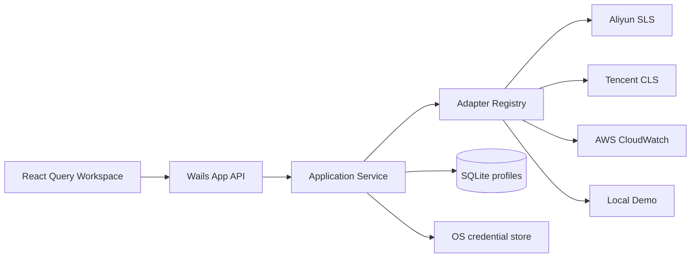

# LogGopher 设计文档

## 设计目标与非目标

目标是用稳定的领域模型统一多个日志平台的连接、资源发现与查询流程，并提供接近云厂商控制台的桌面交互。首版优先保证边界可扩展、凭证不落明文和 Demo 链路可验证。

当前非目标：跨平台查询语法转换、聚合可视化、实时 Tail、团队凭证同步和多窗口协作。厂商 SDK 接入属于下一阶段，不在脚手架中伪实现。

## 架构

- `App`：Wails 边界，只做输入校验与用例转发。
- `Service`：连接会话、Adapter 调度、持久化编排。
- `Adapter`：隔离厂商 SDK，输出统一 Domain DTO。
- `Store`：管理 SQLite 连接、migration 和参数化 SQL。
- `React UI`：连接向导、Logstore 导航、查询编辑器与结果表。

## 关键决策

| 日期 | 决策 | 理由 | 影响 |
|---|---|---|---|
| 2026-07-11 | 模块化单体 | 桌面工具无需微服务运维成本，包边界仍可测试 | 单进程部署，演进简单 |
| 2026-07-11 | Wails v2.10.2 | 支持 Go 1.23，模板与生态稳定 | 后续升级需查 breaking changes |
| 2026-07-11 | modernc SQLite | 纯 Go、跨平台构建不依赖系统 SQLite | 二进制体积增加 |
| 2026-07-11 | 凭证存系统 Keychain | 支持历史连接重用，同时避免 SQLite 明文泄露 | 系统可能请求用户授权访问 |
| 2026-07-11 | 云 Adapter 先显式 stub | 失败可见，不伪造线上能力 | 首版仅 Demo 可完整运行 |
| 2026-07-11 | 设置写入 SQLite | 桌面偏好需跨重启保留且不含敏感信息 | 单行 `app_settings`，值域受约束 |
| 2026-07-11 | 原生菜单 + 窗内快捷入口 | 遵循桌面平台习惯，同时保证跨平台可发现性 | 菜单经 Wails Events 驱动 React 状态 |

## 查询契约

`ConnectionInput` 携带平台连接信息；连接成功返回 `Session` 与 Logstore 列表。`QueryInput` 使用统一时间范围、limit 和原生查询字符串。Adapter 负责平台级校验、分页及响应归一化。未来若要支持查询语法翻译，应增加独立 Query Dialect 层，不能把翻译规则塞入 UI。

## 安全与信任边界

威胁包括恶意 Endpoint 导致 SSRF、桌面数据库泄露、日志中敏感字段暴露、查询资源滥用和错误日志泄密。

- Endpoint 当前仅校验 HTTP(S) 结构；云 Adapter 落地前必须增加厂商域名/自定义 Endpoint 策略、连接超时和响应体限制。
- AK/SK 不写 SQLite、不写日志、不返回前端响应；新连接由 Go 写入系统 Keychain，历史连接由 Go 直接读取并建立会话。
- SQLite 使用参数化查询，目录权限设为 `0700`。
- 云 SDK 必须设置 timeout、分页上限和查询 limit，错误信息不得包含签名请求头。
- `CredentialStore` 隔离凭证后端，当前使用 macOS Keychain、Windows Credential Manager、Linux Secret Service。

## 已知限制与演进顺序

1. 实现阿里云 SLS Adapter，并以接口测试固定资源与查询映射。
2. 增加历史连接编辑、删除以及 Keychain 凭证轮换。
3. 实现 CLS 与 CloudWatch Adapter，统一分页和错误分类。
4. 加入查询历史、字段展开、虚拟列表和 CSV/JSON 导出。
5. 加入实时 Tail、可视化聚合与敏感字段遮罩。

## 变更历史

- 2026-07-11：初始化 Wails/React/SQLite 架构、Demo Adapter 与安全边界。
- 2026-07-11：增加亮/暗/系统主题、中英文切换、显示密度与设置持久化。
- 2026-07-11：视觉系统统一为 ARDM × VS Code 的高密度扁平主题。暗色使用 `#1E1E1E` 主工作区、`#252526` 侧栏，亮色使用 `#FFFFFF` 主工作区、`#F5F5F5` 侧栏；全局禁止渐变、模糊与投影，控件圆角限制为 2–4px。日志级别通过 `FATAL/ERROR/WARN/INFO/DEBUG/TRACE` 语义 Token 在 Light/Dark 下分别映射，主题覆盖集中维护于 `frontend/src/functional-theme.css`。
- 2026-07-11：补齐应用、文件、编辑、视图、窗口、帮助原生菜单与快捷键。
- 2026-07-11：重构连接首屏、Adapter 下拉选择、历史连接直连与系统 Keychain 凭证持久化。
