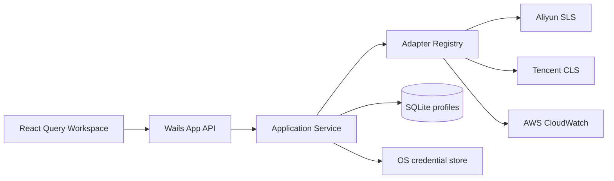

# LogGopher 设计文档

## 设计目标与非目标

目标是用稳定的领域模型统一多个日志平台的连接、资源发现与查询流程，并提供接近云厂商控制台的桌面交互。优先保证边界可扩展、凭证不落明文和真实云平台链路可验证。

当前非目标：跨平台查询语法转换、聚合可视化、实时 Tail、团队凭证同步和多窗口协作。阿里云 SLS 与腾讯云 CLS 已接入官方 SDK；其余厂商能力不会在未接入时伪实现。

## 架构

- `App`：Wails 边界，只做输入校验与用例转发。
- `Service`：连接会话、Adapter 调度、持久化编排。
- `Adapter`：隔离厂商 SDK，输出统一 Domain DTO。
- `Store`：管理 SQLite 连接、migration 和参数化 SQL。
- `React UI`：连接向导、Logstore 导航、查询编辑器与结果表。

## 关键决策

| 日期 | 决策 | 理由 | 影响 |
|---|---|---|---|
| 2026-07-11 | 模块化单体 | 桌面工具无需微服务运维成本，包边界仍可测试 | 单进程部署，演进简单 |
| 2026-07-11 | Wails v2.10.2 | 支持 Go 1.23，模板与生态稳定 | 后续升级需查 breaking changes |
| 2026-07-11 | modernc SQLite | 纯 Go、跨平台构建不依赖系统 SQLite | 二进制体积增加 |
| 2026-07-11 | 凭证存系统 Keychain | 支持历史连接重用，同时避免 SQLite 明文泄露 | 系统可能请求用户授权访问 |
| 2026-07-11 | 未接入的云 Adapter 显式 stub | 失败可见，不伪造线上能力 | 当前仅 CloudWatch 返回明确未实现错误 |
| 2026-07-12 | SLS 使用官方 `aliyun-log-go-sdk` | SDK 原生处理签名、压缩、进度轮询和错误模型 | 厂商类型只存在于 `internal/adapter`，请求受 30 秒超时和 Wails 生命周期约束 |
| 2026-07-12 | CLS 使用官方 API 3.0 Go SDK | `DescribeTopics` 和 `SearchLog` 与最新 API 契约一致 | Topic 名称到 ID 的映射仅存在于 Adapter 会话缓存；请求使用 CQL、毫秒时间和 Offset 分页 |
| 2026-07-12 | 删除本地演示能力与数据 | 产品只展示真实可用平台，避免假数据与线上行为混淆 | migration 清理历史 Demo Profile 和 Query History，Registry/UI 不再暴露 Demo |
| 2026-07-11 | 设置写入 SQLite | 桌面偏好需跨重启保留且不含敏感信息 | 单行 `app_settings`，值域受约束 |
| 2026-07-11 | 原生菜单 + 窗内快捷入口 | 遵循桌面平台习惯，同时保证跨平台可发现性 | 菜单经 Wails Events 驱动 React 状态 |

## 查询契约

`ConnectionInput` 携带平台连接信息；连接成功返回 `Session` 与 Logstore 列表。`QueryInput` 使用统一时间范围、limit 和原生查询字符串。Adapter 负责平台级校验、分页及响应归一化。未来若要支持查询语法翻译，应增加独立 Query Dialect 层，不能把翻译规则塞入 UI。

## 安全与信任边界

威胁包括恶意 Endpoint 导致 SSRF、桌面数据库泄露、日志中敏感字段暴露、查询资源滥用和错误日志泄密。

- SLS Endpoint 允许官方公网、私网、传输加速与已绑定的自定义域名，因此不做固定域名白名单；必须是无凭证、无路径、无 Query/Fragment 的 HTTP(S) URL。SDK HTTP 请求和重试均限制为 30 秒并绑定应用生命周期 Context。
- CLS Endpoint 同样必须是无凭证、无路径、无 Query/Fragment 的 HTTP(S) URL；Region 是 API 3.0 签名必填项。SDK 请求限制为 30 秒并直接使用 `WithContext` 接收取消信号。
- AK/SK 不写 SQLite、不写日志、不返回前端响应；新连接由 Go 写入系统 Keychain，历史连接由 Go 直接读取并建立会话。
- SQLite 使用参数化查询，目录权限设为 `0700`。
- 云 SDK 必须设置 timeout、分页上限和查询 limit，错误信息不得包含签名请求头。
- `CredentialStore` 隔离凭证后端，当前使用 macOS Keychain、Windows Credential Manager、Linux Secret Service。

## 已知限制与演进顺序

1. 增加历史连接编辑、删除以及 Keychain 凭证轮换。
2. 实现 CloudWatch Adapter，统一分页和错误分类。
3. 加入查询历史、字段展开、虚拟列表和 CSV/JSON 导出。
4. 加入实时 Tail 与可视化聚合。

## 变更历史

- 2026-07-11：初始化 Wails/React/SQLite 架构与安全边界。
- 2026-07-11：增加亮/暗/系统主题、中英文切换、显示密度与设置持久化。
- 2026-07-11：视觉系统统一为 ARDM × VS Code 的高密度扁平主题。暗色使用 `#1E1E1E` 主工作区、`#252526` 侧栏，亮色使用 `#FFFFFF` 主工作区、`#F5F5F5` 侧栏；全局禁止渐变、模糊与投影，控件圆角限制为 2–4px。日志级别通过 `FATAL/ERROR/WARN/INFO/DEBUG/TRACE` 语义 Token 在 Light/Dark 下分别映射，主题覆盖集中维护于 `frontend/src/styles/functional-theme.css`。
- 2026-07-12：运行日志采用标准库 `log/slog` JSON Handler，`lumberjack` 仅负责文件滚动。日志目录遵循各平台用户日志约定，文件权限在 POSIX 系统设为 `0600`；按产品要求不执行日志内容脱敏，调用方负责控制写入内容。帮助菜单仅调用系统文件管理器打开已创建的日志目录。
- 2026-07-12：查询历史持久化到 SQLite `query_history`，以 `profile_id + logstore + query` 唯一约束去重，每个日志库保留最近 50 条；前端通过 Wails API 读取最近 20 条。智能提示仅从当前标准化查询结果提取字段路径，不引入厂商 SDK 类型。
- 2026-07-12：前端从扁平 `src` 重构为 `app / components / features / styles / assets` 分层；`main.tsx` 只负责挂载，`app` 负责 Wails API 编排，通用日期组件进入 `components`，日志结果业务进入 `features`，生成绑定继续固定在 `frontend/wailsjs`。
- 2026-07-12：接入阿里云官方 `aliyun-log-go-sdk v0.1.122`。连接使用 `ListLogStore` 验证 Project 和读取权限；查询使用 `GetLogsV2` 完成进度轮询、倒序分页和统一 DTO 映射，并使用 `GetHistograms` 获取匹配总数。
- 2026-07-12：结果菜单生成的 SLS `key:value` 条件优先使用字段索引精确查询；若 SLS 以 `ParameterInvalid` 明确指出该 key 未配置字段索引，Adapter 仅将对应条件降级为全文短语并自动重试，其余已索引条件保持不变。相同的有效表达式同时用于日志查询和 Histogram，避免两者统计口径分裂。
- 2026-07-12：删除本地演示 Adapter、生成数据、测试和 UI 入口；SQLite migration 同步删除遗留 Demo 连接与查询历史。接入腾讯云 CLS API 3.0 Go SDK `v1.3.131`，使用 `DescribeTopics` 枚举 Topic、`SearchLog` 执行 CQL 检索，并以精确 SQL count 支撑统一分页总数。
- 2026-07-11：补齐应用、文件、编辑、视图、窗口、帮助原生菜单与快捷键。
- 2026-07-11：重构连接首屏、Adapter 下拉选择、历史连接直连与系统 Keychain 凭证持久化。
