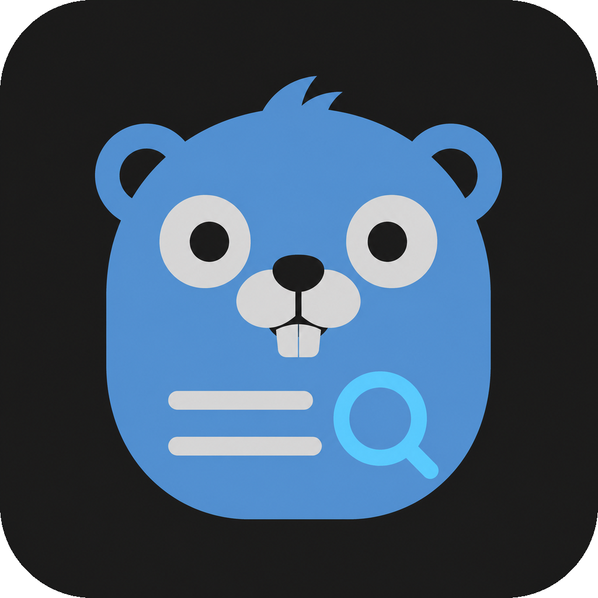

# LogGopher

<p align="center">
  
</p>

<p align="center">
  <strong>简洁、统一的多云日志查询桌面工具</strong>
</p>

<p align="center">
  简体中文 | <a href="README_EN.md">English</a>
</p>

LogGopher 是基于 Go、Wails 和 React 构建的跨平台日志查询工具。它通过统一界面连接阿里云 SLS、腾讯云 CLS 和 AWS CloudWatch Logs，方便开发者集中查询、筛选和分析不同云平台的日志。

## 功能

- 通过桌面连接工作台搜索、分页、查看、修改并快速切换云平台连接
- 以 Project/Region 和 Logstore/Topic/Log Group 树浏览日志资源
- 支持时间筛选、查询历史、分页和日志分布图
- 支持嵌套 JSON 展开、字段筛选及原始日志/表格视图
- 通过独立偏好设置页切换亮色、暗色、跟随系统主题和中英文界面
- 使用本地 SQLite 统一保存连接配置与 AK/SK
- 编辑连接时直接回填 AK，SK 默认遮罩并支持按需显示

## 快速开始

可从 [GitHub Releases](https://github.com/liangguifeng/LogGopher/releases) 下载对应操作系统和 CPU 架构的安装包。

环境要求：Go 1.25、Node.js 20+，以及对应平台的 [Wails v2](https://wails.io/docs/gettingstarted/installation) 依赖。

```bash
git clone https://github.com/liangguifeng/LogGopher.git
cd LogGopher

cd frontend
npm install
cd ..

make doctor
make dev
```

构建生产版本：

```bash
make build
```

## 项目结构

```text
.
├── app.go                 # Wails API 边界
├── main.go                # 应用入口与依赖装配
├── menu.go                # 原生菜单
├── internal/
│   ├── adapter/           # 云日志平台适配器
│   ├── application/       # 应用用例与会话
│   ├── credential/        # SQLite 凭证访问与旧凭证迁移
│   ├── domain/            # 统一领域模型
│   ├── logging/           # JSON 运行日志
│   └── storage/           # SQLite 持久化
├── frontend/              # React + TypeScript 前端
├── DESIGN.md              # 架构与设计说明
└── docs/                  # 开发文档
```

## 贡献指南

欢迎提交 Issue 和 Pull Request。

1. Fork 仓库并创建功能分支。
2. 完成功能并补充相应测试。
3. 执行 `make check`，确保测试、检查和构建通过。
4. 提交 Pull Request，并清楚描述改动内容。

开发前请阅读 [DESIGN.md](DESIGN.md)、[AGENTS.md](AGENTS.md) 和 [注释规范](docs/COMMENTING.md)。

## 开源协议

本项目基于 [MIT License](LICENSE) 开源。

## 致谢

非常感谢 JetBrains 向我提供了执照，可以从事该项目和其他开源项目。

[](https://www.jetbrains.com/?from=https://github.com/liangguifeng)
